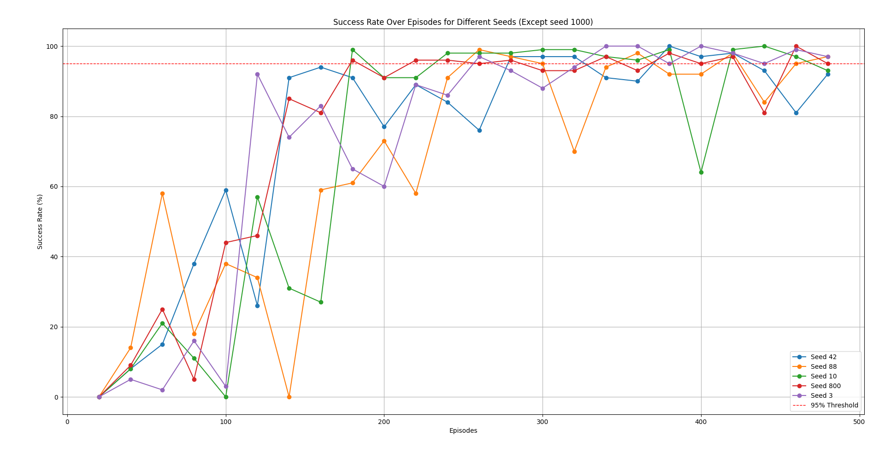
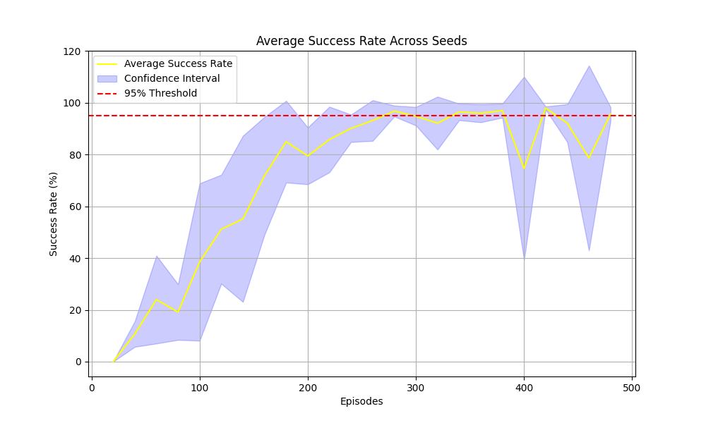

# 🤖 Deep Reinforcement Learning for Robotic Arm Control
**Soft Actor-Critic (SAC) + Hindsight Experience Replay (HER)** on the **FetchReach** environment (sparse rewards) implemented in **PyTorch**.  
The agent learns continuous control policies with **twin critics**, **stochastic actor**, and **automatic entropy tuning**; HER relabels goals to dramatically improve sample-efficiency.

---

## 📂 Repository Layout
```
.
├─ Gym_Training_Environment.py   # environment wrapper / training loop
├─ SAC_Network_Agent.py          # SAC: actor, twin critics, target nets, alpha tuning
├─ HERAgent.py                   # HER replay buffer & relabeling
├─ PerformanceAsseser.py         # eval + plotting utilities
├─ RUN_MODEL.py                  # run trained policy for demos/evals
├─ prerun.py                     # quick sanity run / smoke test
├─ performanceAssessment/        # results (plots per seed + combined)
│  ├─ combined_RESULTS.png
│  ├─ SAC_AVG_PERFORMANCE.png
│  ├─ seed3.png
│  ├─ seed10.png
│  ├─ seed42.png
│  ├─ seed800.png
│  └─ seed1000.png
├─ trained_models/               # pretrained policies (PyTorch .pth)
│  ├─ policy_model_3.pth
│  ├─ policy_model_10.pth
│  ├─ policy_model_42.pth
│  ├─ policy_model_800.pth
│  └─ policy_model_1000.pth
├─ installation.md               # detailed Gymnasium + MuJoCo setup
├─ requirements.txt
└─ README.md
```

---

## ✨ Highlights
- **Algorithms**: Soft Actor-Critic (entropy-regularized actor-critic) + **HER** goal relabeling
- **Stability**: Twin critics, target networks, automatic temperature (α) tuning
- **Results**: **90–95% success** on FetchReach across **5 seeds** (3, 10, 42, 800, 1000)
- **Reproducible**: Seeded training/eval + plots for learning dynamics

---

## 📥 Installation Note
Setting up the **FetchReach Gymnasium Robotics environment with MuJoCo** requires extra system dependencies and manual configuration.  

👉 Please follow the step-by-step guide in [**installation.md**](./installation.md) before running any training scripts.  

That document covers:  
- System package dependencies (Mesa, GLEW, etc.)  
- Python environment setup (venv / pip)  
- MuJoCo installation & environment variables  
- Known Gymnasium bug fixes (robot initial positions)  
- Troubleshooting (Cython errors, version mismatches)  

---

## 🖥️ Quick Start

### 1) Environment
```bash
# Using conda
conda create -n sac-her python=3.9 -y
conda activate sac-her

# Or with venv
python -m venv sac-her-env
# macOS/Linux
source sac-her-env/bin/activate
# Windows
.\sac-her-env\Scripts\activate
```

### 2) Install dependencies
```bash
pip install -r requirements.txt
```

### 3) Verify PyTorch can see GPU (optional but recommended)
```bash
python - << 'PY'
import torch; print("CUDA available:", torch.cuda.is_available())
PY
```

---

## 🚀 Train

### Default training run (single seed)
```bash
python Gym_Training_Environment.py
```

### Multi-seed sweep (recommended)
```bash
# inside Gym_Training_Environment.py you can set SEEDS = [3, 10, 42, 800, 1000]
python Gym_Training_Environment.py
```

This script:
- builds the **SAC** agent (actor + twin critics + targets, α auto-tuning),
- wraps the environment (FetchReach),
- enables **HER** relabeling in the replay buffer,
- trains and periodically evaluates; metrics/plots are saved to `performanceAssessment/`
- checkpoints policies into `trained_models/`.

---

## ▶️ Run a pretrained model (demo/eval)
```bash
# Choose a checkpoint, e.g., trained_models/policy_model_42.pth
python RUN_MODEL.py --checkpoint trained_models/policy_model_42.pth
```

Options you can pass (if implemented in the script):
```
--episodes 100         # number of eval episodes
--render               # visualize environment if available
--seed 42              # reproducibility
```

---

## 📊 Results (FetchReach)

<p align="center">
  
  
</p>

- All seeds converge to **90–95% success**.
- Oscillations later in training are analyzed (critic target lag, buffer mix, HER ratio).

Per-seed curves are available in `performanceAssessment/seed*.png`.
See detailed figures and ablations in the [](./RL_FINAL_REPORT)


---

## 🔧 Key Implementation Notes
- **SAC**:
  - Actor: Gaussian policy with Tanh squashing → continuous actions
  - Critics: **Twin Q networks**, MSE Bellman backups, **target networks** with soft-updates
  - **Automatic entropy** (temperature α) tuning to balance exploration/exploitation
- **HER**:
  - Goal-conditioned transitions `(s, a, r, s', g)` augmented by relabeling with achieved goals
  - Improves learning signal under sparse rewards

---


